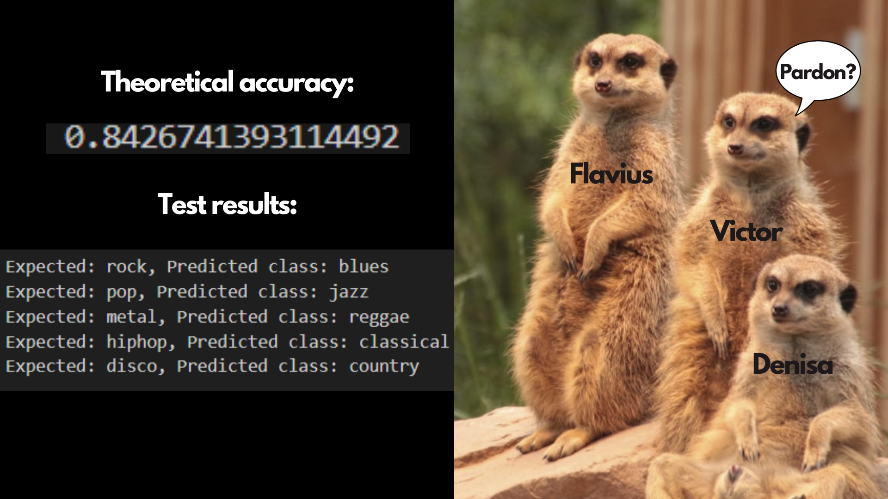

# Music-Genre-Classification

Our project consists of a web interface for running a classification algorithm on a given .wav file received as input.
It is made up of a web server written in Flask, an interface in HTML, CSS and JavaScript and a LSTM Machine Learning model trained using the GTZAN dataset.

We split the three main parts of our project: frontend, classification algorithm and backend, and worked separately, at first. 

Victor was responsible for the frontend part, implementing the HTML templates rendered by the server.
Flavius wrote the Flask code for the server and assisted in the testing process for the three models developed.
Denisa implemented the classification algorithms and integrated the frontend, the chosen algorithm and the backend. 

We implemented three versions of the classification algorithm and added improvements to the second one, which gave the best results to the set of songs we used to test them and is the one we eventually went for.

This GTZAN Music Genre Dataset used for training the models contains 1,000 song samples, each 30 seconds long, belonging to a total of 10 conventional music genres: blues, classical, country, disco, hip-hop, jazz, metal, pop, reggae, and rock. It also contains an alternate representation as images of Mel Spectrograms. Despite being beginner-friendly, the challenge with this dataset was that the restricted number of samples (less than 800 after a decent train-val-test split) was not ideal in order to get great results.

   * The first algorithm uses **K-Nearest Neighbours**, which is a popular machine learning algorithm for regression and classification. It makes predictions on data points based on their similarity measures i.e distance between them. It processes the audio files in the GTZAN dataset, extracts MFCC features, calculates mean and covariance matrices, and stores them along with the corresponding class labels in a binary file named "my.dat". Then, the dataset is split into training and testing sets based on a 66:34 ratio. The model is trained using KNN, tested and resulted accuracy is printed at the end (theoretical accuracy around 68%).

   * The second algorithm creates an **LSTM** model using MFCC features. It extracts the features of the songs in the dataset and creates the model using three LSTM layers with 64 units each, in order to capturing temporal dependencies in the MFCC sequences. Additionally, there are two dense layers, one with ReLU activation and the other with softmax activation for classification. The model is compiled using the Adam optimizer, sparse categorical cross-entropy loss function, and accuracy as the evaluation metric. It is then trained on the training set and validated on the validation set using the fit method. (theoretical accuracy of around 74%)

   * The third algorithm is based on **CNN**. It preprocesses the files similarly to the second algorithm in order to extract MFCC features and reshapes them for compatibility. The CNN model is, then, defined using the Keras Sequential API. It consists of multiple convolutional layers with activation functions, max-pooling layers, dropout layers for regularization, and dense layers for classification. The CNN model is compiled using binary cross-entropy loss, the Adam optimizer, and accuracy as the evaluation metric, trained and tested. (theoretical accuracy of around 88%)

Working on these algorithms was one of the biggest challenges due to the limitations of the GTZAN dataset and laborious training and testing processes. 

Repo content:
  * "flask-server" directory => server logic
      * static folder => Javascript files
      * templates folder => HTML files
      * server.py => Flask server (for testing, enter **python3 server.py** command in terminal and go to http://127.0.0.1:5000/)
      * GTZAN_LSTM.h5 => classification model based on the second algorithm
      * classify.py => program that fits a given song into a genre category based on the model mentioned above
      * uploads => folder that stores the uploaded files when pushing the button "Upload File"
  * "classification_alg" directory
      * test_songs => songs used to test the model
      * Data => GTZAN dataset
      * first_alg/second_alg/third_alg => the 3 classification algorithms and programs used to test them 

